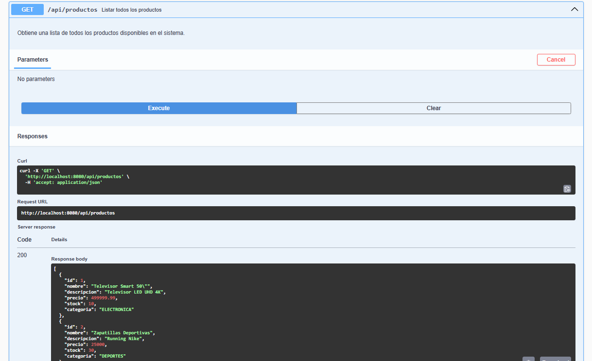
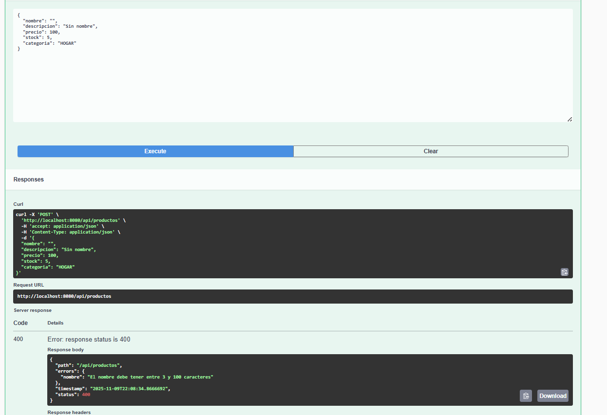
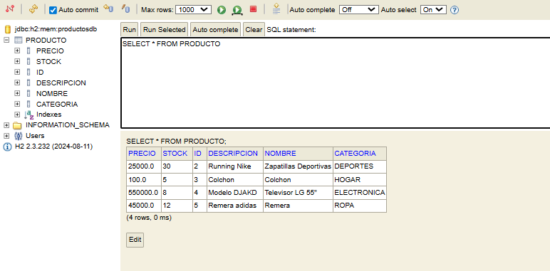

## 📝 Descripción del proyecto

API REST simple para la gestión de productos desarrollada con Spring Boot. Provee operaciones CRUD sobre productos (crear, leer, actualizar, eliminar), filtrado por categoría y actualización de stock. Está pensada como práctica educativa para aprender desarrollo de APIs, validación con Jakarta Validation, documentación con OpenAPI/Swagger y persistencia en H2 en memoria.

## ⚙️ Tecnologías utilizadas

-   Java 17 (o versión compatible con el proyecto)
-   Spring Boot
-   Spring Web
-   Spring Data JPA
-   H2 Database (memoria)
-   Jakarta Validation (bean validation)
-   springdoc-openapi / Swagger UI
-   Maven (wrapper incluido)

## 🚀 Instrucciones para clonar y ejecutar

1. Clonar el repositorio:

```powershell
git clone <URL_DEL_REPOSITORIO>
cd TP-Api-Rest-Spring-Boot
```

2. Ejecutar con el wrapper en Windows (PowerShell):

```powershell
.\mvnw.cmd spring-boot:run
```

Alternativamente, crear el artefacto y ejecutarlo:

```powershell
.\mvnw.cmd clean package
java -jar target\productos-api-0.0.1-SNAPSHOT.jar
```

Por defecto la aplicación se levanta en http://localhost:8080

## 🌐 Tabla de endpoints

| Método | Ruta                                 | Descripción                                           |
| ------ | ------------------------------------ | ----------------------------------------------------- |
| GET    | /api/productos                       | Listar todos los productos (200)                      |
| GET    | /api/productos/{id}                  | Obtener producto por ID (200) / 404 si no existe      |
| GET    | /api/productos/categoria/{categoria} | Filtrar productos por categoría (200)                 |
| POST   | /api/productos                       | Crear nuevo producto (201) / 400 si datos inválidos   |
| PUT    | /api/productos/{id}                  | Actualizar producto completo (200) / 404 si no existe |
| PATCH  | /api/productos/{id}/stock            | Actualizar solo stock (200) / 404 si no existe        |
| DELETE | /api/productos/{id}                  | Eliminar producto (204) / 404 si no existe            |

Notas:

-   Las validaciones de entrada se realizan mediante anotaciones en `ProductoDTO` (se devuelven errores 400 con un cuerpo tipo `ErrorResponse`).
-   `categoria` es un enumerado (`Categoria`) — pasar valores válidos (ej. ELECTRONICA, HOGAR, DEPORTES, ROPA) según el enum.

## 📸 Capturas de pantalla de Swagger UI

### Documentación completa de endpoints

La API cuenta con todos los endpoints CRUD documentados en Swagger UI:



### Prueba exitosa de POST (creando producto)

Creación exitosa de un nuevo producto (respuesta 201):


### Prueba de GET (listando productos)

Listado completo de productos disponibles:


### Prueba de GET por ID exitoso

Obtener un producto específico por su ID:


### Error 404 cuando producto no existe

Respuesta cuando se busca un producto que no existe:


### Error 400 de validación

Validación de datos inválidos:

**Precio negativo:**


**Nombre vacío:**



### Actualización de productos

**PUT - Actualización completa:**


**PATCH - Actualización de stock:**


### Eliminación de producto


### Consola H2 con datos persistidos

Vista de la base de datos H2 con los productos guardados:



## 🔗 Acceder a Swagger UI y consola H2

-   Swagger UI (documentación interactiva):

    -   http://localhost:8080/swagger-ui/index.html
    -   o /swagger-ui.html (dependiendo de la versión/configuración)

-   Consola H2:
    -   http://localhost:8080/h2-console
    -   JDBC URL: `jdbc:h2:mem:productosdb`
    -   User: `sa`
    -   Password: (vacío)

Nota: en `application.properties` está configurado:

```
spring.h2.console.enabled=true
spring.h2.console.path=/h2-console
spring.datasource.url=jdbc:h2:mem:productosdb
```

## 💭 Conclusiones personales sobre lo aprendido

A través del desarrollo de esta API REST, logré consolidar varios conceptos fundamentales:

-   **Arquitectura en capas**: Comprendí la importancia de separar responsabilidades entre controlador, servicio y repositorio. Esta estructura facilita el mantenimiento y testing del código.

-   **Validación robusta**: Implementar Jakarta Validation me permitió asegurar la integridad de los datos desde el primer punto de entrada. Las anotaciones como `@NotBlank`, `@Positive` y `@NotNull` simplifican la validación sin escribir código repetitivo.

-   **Manejo centralizado de excepciones**: Crear un `GlobalExceptionHandler` con `@ControllerAdvice` me ayudó a estandarizar las respuestas de error y proveer mensajes claros al cliente, mejorando la experiencia del desarrollador que consume la API.

-   **Documentación automática con OpenAPI**: Integrar Swagger/springdoc-openapi transformó completamente la forma de compartir la especificación de la API. La documentación interactiva facilita las pruebas y reduce la curva de aprendizaje para otros desarrolladores.

-   **Persistencia con H2**: Trabajar con una base de datos en memoria resultó muy práctico para desarrollo y demos. La consola H2 me permitió verificar el estado de la base de datos en tiempo real y entender mejor cómo JPA mapea las entidades.

-   **DTOs y mapeo**: Aprendí la importancia de no exponer entidades directamente. Los DTOs me dieron control sobre qué información se envía/recibe y permiten evolucionar el modelo de dominio sin romper contratos con los clientes.

Este proyecto me dio confianza para desarrollar APIs REST profesionales y me preparó para trabajar con arquitecturas más complejas en el futuro.

## ✅ Requisitos y casos de prueba (sugeridos)

-   Crear producto válido -> 201 (ver `swagger_post_success.png`)
-   Listar productos -> 200 y comprobar que el nuevo producto aparece (ver `swagger_get_list.png`)
-   Solicitar ID inexistente -> 404 (ver `swagger_404.png`)
-   Enviar payload con nombre vacío o precio negativo -> 400 (ver `swagger_400_validation.png`)
-   Abrir consola H2 y verificar fila en la tabla `PRODUCTO` (ver `h2_console.png`)

## 👤 Autor

**Antonella Aldao** — Legajo 50715

---

_Proyecto desarrollado como práctica de Desarrollo de Software - UTN_
